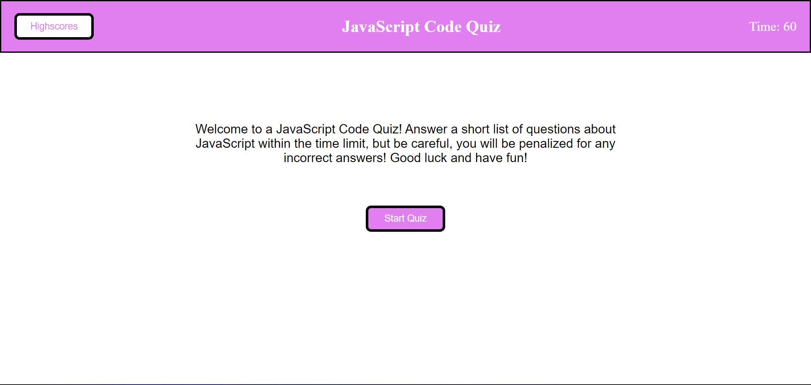

# JavaScript Code Quiz
This repository contains code that allows a user to play a quiz game. The quiz consists of five questions that cover JS topics. Each question is displayed individually as a user answers them, but if they get the question wrong, ten seconds get deducted from the 60 second time limit. Once a user has answered all of the questions, or if time runs out, then the game ends, and the user is prompted to enter their initials for their score. Their scores are then saved and displayed on a leaderboard. If they wanted to, a user can clear the leaderboard for a fresh start. 

# Screenshot

# Link to Deployed App 
https://dfussell1.github.io/challenge-four-coding-quiz/